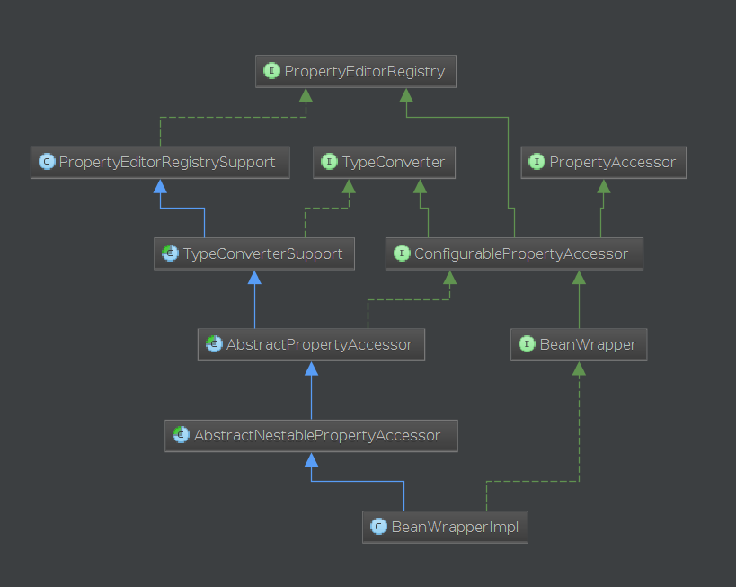

# BeanWrapper

## interface
PropertyEditorRegistry
封装注册JavaBeans PropertyEditor的方法。

TypeConverter
定义类型转换方法。
实现类一般会实现PropertyEditorRegistry接口。由于java.beans.PropertyEditor不是线程安全的，它的实现类一般也不是线程安全的。

PropertyAccessor
用于访问对象属性。

ConfigruablePropertyAccessor
封装PropertyAccessor的配置方法。
public interface ConfigurablePropertyAccessor extends PropertyAccessor, PropertyEditorRegistry, TypeConverter {}

BeanWrapper
Spring 底层处理JavaBeans的核心接口。
主要是供BeanFactory和DataBinder使用。
提供对标准JavaBeans的分析、操作：设置、读取属性值；获取属性描述；查询属性是否可读、可写。
可以设置多层属性。
public interface BeanWrapper extends ConfigurablePropertyAccessor {}

## class

PropertyEditorRegistrySupport
PropertyEditorRegistry的默认实现。提供默认编辑器、自定义编辑器的管理。

TypeConverterSupport
TypeConverter的基础实现，使用package-private委托。
public abstract class TypeConverterSupport extends PropertyEditorRegistrySupport implements TypeConverter {}

AbstractPropertyAccessor
PropertyAccessor的抽象实现。提供全部转换方法的基础实现，将具体属性的访问留给子类实现。
public abstract class AbstractPropertyAccessor extends TypeConverterSupport implements ConfigurablePropertyAccessor {}

AbstractNestablePropertyAccessor
一个ConfigurablePropertyAccessor实现，为典型使用提供必备实现。
可以处理collesction和array类型的值。
public abstract class AbstractNestablePropertyAccessor extends AbstractPropertyAccessor {}

BeanWrapperImpl
BeanWrapper的默认实现，足够一般情况下使用。
public class BeanWrapperImpl extends AbstractNestablePropertyAccessor implements BeanWrapper {}

